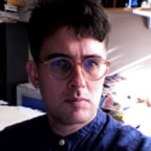
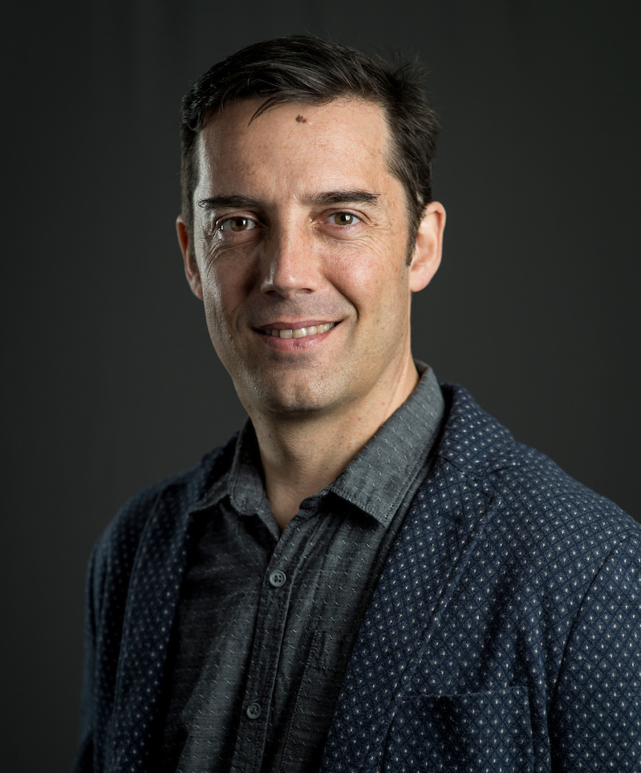

## Current Developers

  Vincent Carey

 Martin Morgan (PI)

  Sehyun Oh

 Marcel Ramos

 Lori Ann Shepherd (PM)

 Nitesh Turaga

  Levi Waldron

## Past Developers

<ul>
  <li>BJ Stubbs</li>
  <li>Shweta Gopaulakrishnan</li>
  <li>Ludwig Geistlinger</li>
</ul>
